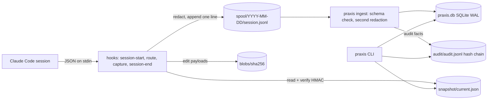

# Architecture

The full design is in [MASTER_PROMPT.md](MASTER_PROMPT.md) Part D. This page describes what
exists after Phase 0.

## Data flow

## Rules that shape the code

- **Hot path** (`packages/hooks`): Node built-ins only, single-file bundles under 300 KB,
  no model calls, no network, no SQLite, no locks. Each hook reads stdin (without waiting
  for EOF once a full JSON object has arrived), does one append, prints at most one JSON
  object and exits. A watchdog exits at 80% of the hook's budget.
- **Control plane** (`core/praxis`): Python standard library only. Every write that needs
  ordering (audit chain, ingest offsets) takes a lock file; hooks never do.
- **Shared contracts**: `schemas/*.json` generate the types for both languages;
  `schemas/redaction-rules.json` is the only place redaction patterns live; canonical JSON
  (`canonical.py` / `canonical.ts`) is byte-identical in both, which the snapshot HMAC and
  the audit hash depend on. Parity fixtures in `tests/fixtures/` are checked by both suites.

## Failure behavior

| Condition | Hooks | CLI |
|---|---|---|
| `praxis init` not run | Write nothing; SessionStart shows one hint on startup | Commands report `not_initialized` |
| Snapshot HMAC mismatch or missing | Safe mode: one `systemMessage` per session, audit fact spooled | `doctor` fails, `status` shows `safe_mode` |
| Invalid stdin | Exit 0, log to `logs/hooks.log` | — |
| Internal error | Exit 0, log, spool an audit fact | Error message, exit 1 |
| Malformed spool line | — | Skipped, counted in `spool_files.malformed` |
| SessionEnd not delivered | — | Next `praxis` command ingests; `ended_at` stays empty |
